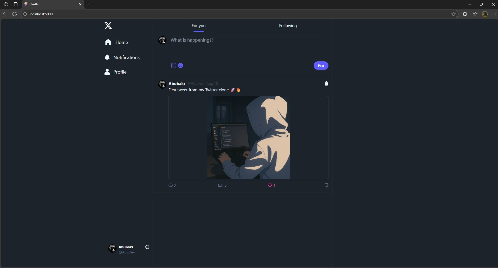
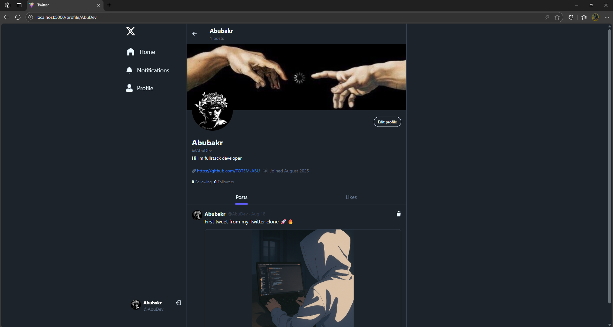

# FullStack Twitter Clone

A full-stack Twitter clone built with the MERN stack (MongoDB, Express.js, React, Node.js) that replicates core Twitter functionality including user authentication, posting, following, and notifications.

## Table of Contents

- [Features](#features)
- [Technologies Used](#technologies-used)
- [Project Structure](#project-structure)
- [API Endpoints](#api-endpoints)
- [Screenshots](#screenshots)

## Features

- User authentication (signup, login, logout)
- Create, read, update, and delete posts
- Like and comment on posts
- Follow/unfollow users
- Real-time notifications
- User profiles with profile picture and bio editing
- Responsive design for all device sizes

## Technologies Used

### Backend

- **Node.js** - JavaScript runtime environment
- **Express.js** - Web application framework
- **MongoDB** - NoSQL database
- **Mongoose** - MongoDB object modeling tool
- **JWT** - JSON Web Tokens for authentication
- **Bcrypt** - Password hashing
- **Cloudinary** - Image hosting service
- **Cookie-parser** - Parsing cookie header

### Frontend

- **React** - JavaScript library for building user interfaces
- **React Router** - Declarative routing for React
- **Tailwind CSS** - Utility-first CSS framework
- **DaisyUI** - Tailwind CSS component library
- **TanStack Query** - Server state management
- **React Icons** - Popular icons as React components
- **Vite** - Frontend build tool

## Project Structure

```
.
├── backend/
│   ├── controllers/     # Request handlers
│   ├── db/             # Database connection
│   ├── middleware/     # Custom middleware
│   ├── models/         # Mongoose models
│   ├── routes/         # API routes
│   └── server.js       # Entry point
├── frontend/
│   ├── src/
│   │   ├── components/ # React components
│   │   ├── hooks/      # Custom React hooks
│   │   ├── pages/      # Page components
│   │   ├── utils/      # Utility functions
│   │   ├── App.jsx     # Main App component
│   │   └── main.jsx    # Entry point
│   └── vite.config.js  # Vite configuration
```

## API Endpoints

### Authentication

- `POST /api/auth/signup` - Register a new user
- `POST /api/auth/login` - Login user
- `POST /api/auth/logout` - Logout user
- `GET /api/auth/me` - Get authenticated user

### Users

- `GET /api/users/profile/:username` - Get user profile
- `PUT /api/users/follow/:id` - Follow/unfollow user
- `PUT /api/users/update` - Update user profile
- `GET /api/users/suggested` - Get suggested users

### Posts

- `POST /api/posts/create` - Create a new post
- `GET /api/posts/all` - Get all posts
- `GET /api/posts/liked/:id` - Get posts liked by user
- `GET /api/posts/following` - Get posts from followed users
- `GET /api/posts/user/:username` - Get user's posts
- `DELETE /api/posts/:id` - Delete a post
- `PUT /api/posts/like/:id` - Like/unlike a post

### Notifications

- `GET /api/notifications` - Get user notifications
- `DELETE /api/notifications` - Delete all notifications

## Screenshots



